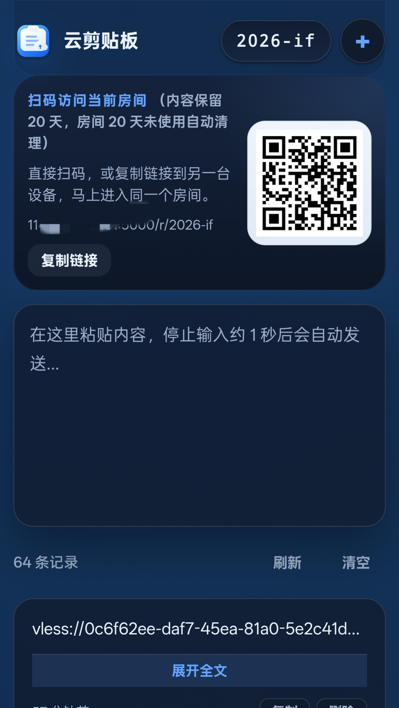
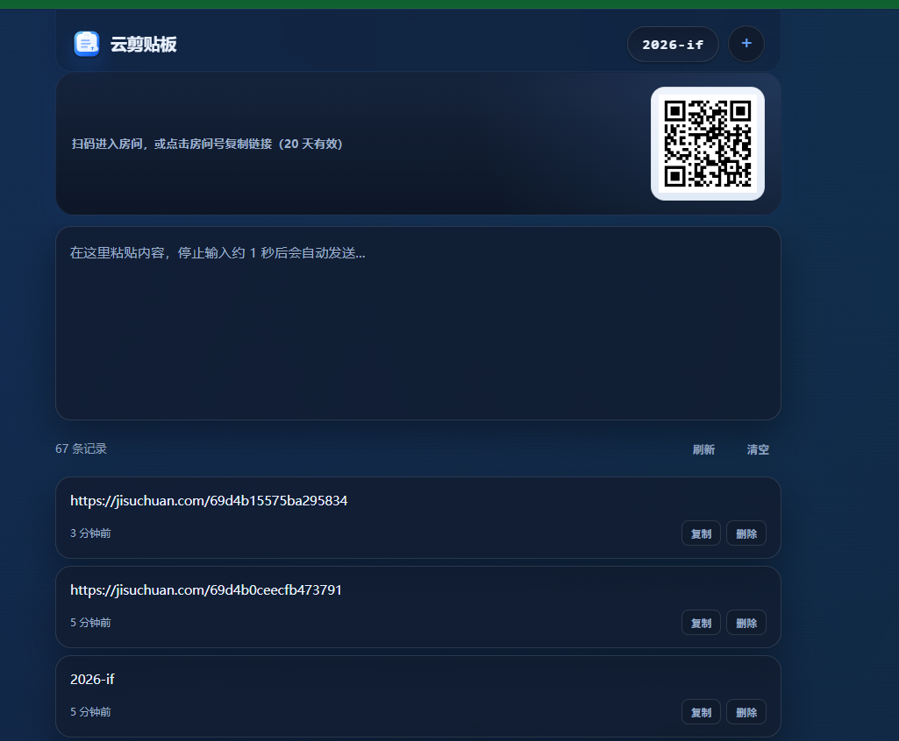

# 云剪贴板 Cloud Clipboard

<div align="center">

手机、电脑之间传文字，扫码即达，不用装 APP，不用登录。

<p>
  
  
  
  
</p>

</div>

---

## 一句话介绍

**打开网页 → 粘贴内容 → 扫码/复制链接 → 另一台设备收到。**

没有账号、没有 APP、没有安装。

## 效果预览

### 手机端



### 网页端



## 30 秒上手

### 第一步：启动服务

```bash
git clone git@github.com:qnmlgbd250/cloud-clipboard.git
cd cloud-clipboard
python -m venv .venv
```

Windows 激活虚拟环境：
```bash
.venv\Scripts\activate
```

macOS / Linux 激活虚拟环境：
```bash
source .venv/bin/activate
```

安装依赖并启动：
```bash
pip install -r requirements.txt
python app.py
```

启动后浏览器会自动打开 `http://127.0.0.1:5000`。

### 第二步：开始使用

1. 页面会自动进入一个"房间"（顶部蓝色标签就是房间号）
2. 在输入框粘贴你要发送的文字
3. **停止输入约 1 秒后自动发送**，不需要点按钮
4. 用另一台设备 **扫码** 或 **点击房间号复制链接** 即可进入同一个房间
5. 两边内容实时同步

### 第三步：分享给别人

- **同局域网**：把浏览器地址栏的链接发给对方
- **不在同一网络**：部署到公网后，把链接或二维码发给对方

## 常见问题

**Q：需要注册登录吗？**

A：不需要。打开链接就能用。

**Q：内容会丢吗？**

A：内容保留 20 天，超过 20 天自动清理。如果房间 20 天没人用也会自动清理。

**Q：数据安全吗？**

A：房间号是随机的（或自定义的），知道链接的人才能访问。内容存在你自己的服务器上。

**Q：能传图片/文件吗？**

A：目前只支持纯文本。图片和文件传图传文件功能在规划中。

**Q：房间号能改吗？**

A：点击顶部 `+` 按钮可以新建随机房间，也可以自定义房间号。

## 适合谁用

| 场景 | 举例 |
| --- | --- |
| 手机 → 电脑 | 手机上看了一篇文章，复制链接发到电脑继续看 |
| 电脑 → 手机 | 电脑上写好的一段代码，发到手机上粘贴用 |
| 电脑 → 电脑 | 家里电脑和公司电脑之间传一段配置或命令 |
| 临时分享 | 把链接发给朋友，大家一起往同一个房间贴东西 |

## 技术栈

- **后端**：Python + Flask
- **前端**：HTML + CSS + 原生 JavaScript
- **实时推送**：Server-Sent Events（不支持时自动回退轮询）
- **二维码**：`qrcode` 库自动生成
- **存储**：本地 JSON 文件，每个房间一个文件

## 项目结构

```
cloud-clipboard/
|-- app.py              # Flask 后端，所有接口逻辑
|-- requirements.txt    # Python 依赖
|-- data/               # 房间数据存放目录（自动创建）
|-- static/
|   |-- app.js          # 前端交互逻辑
|   `-- style.css       # 样式
`-- templates/
    `-- index.html      # 页面模板
```

## 部署建议

推荐部署环境：
- 个人 VPS
- 家庭服务器 / NAS
- Docker 容器
- 任何能跑 Python 的地方

公网部署建议补充：
- HTTPS（Let's Encrypt 免费证书即可）
- Nginx 反向代理
- 基础的访问日志

## Docker 部署

仓库现在已经自带：

- `Dockerfile`
- `docker-compose.yml`
- `gunicorn.conf.py`

和以前“容器启动时执行 `pip install`”不同，现在依赖会在 **镜像构建阶段** 安装，容器启动时只负责拉起 Gunicorn。

### 本地或服务器命令行

```bash
docker compose build
docker compose up -d
```

### 1Panel 使用建议

- 编排目录直接选当前项目目录
- 使用仓库里的 `docker-compose.yml`
- 首次是 `build`，会联网安装一次依赖
- 后续普通重启容器不会再次下载依赖
- 只挂载 `./data:/app/data`，不要再把整个项目目录挂到 `/app`

### 为什么这里默认是 `1 worker`

这个项目的 SSE 房间订阅目前保存在进程内内存里。  
如果 Gunicorn 开多个 worker，不同请求可能落到不同进程，实时广播会互相看不见，表现为“有时更新不及时”。

所以当前配置采用：

- `1` 个 worker
- 较多 threads 处理 SSE 长连接
- Gunicorn 负责生产环境运行

如果以后把房间广播改成 Redis 这类共享通道，再考虑多 worker 会更合适。

## Roadmap

- 图片、文件传输支持
- 阅后即焚消息
- 房间密码 / 一次性访问
- 历史搜索
- Docker 化部署
- 数据库后端（SQLite / PostgreSQL）

## License

当前未声明许可证。如需开源使用，建议补充 MIT 等许可证。
