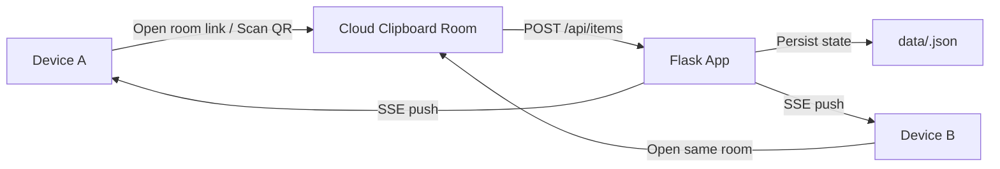

# Cloud Clipboard

<div align="center">

### A lightweight self-hosted clipboard bridge for all your devices

在手机、电脑、平板之间，快速同步一段文本，不登录、不安装客户端、打开链接就能用。

<p>
  
  
  
  
  
</p>

</div>

---

## Preview

**Cloud Clipboard** 是一个面向真实日常场景的小而美工具：

- 电脑上复制了一段命令，想立刻发到手机
- 手机上记下了一段文字，想无缝切到电脑继续用
- 两台设备之间临时传一段代码、链接或备忘

它没有复杂账户体系，也不依赖重客户端，而是用一个简单的“房间”模型把跨设备同步这件事做得足够轻、足够快、足够直接。

## Why It Feels Good

很多“跨设备剪贴板”产品都很强大，但也常常很重：

- 需要登录
- 强依赖平台生态
- 部署和维护成本高
- 数据流转不够透明

`Cloud Clipboard` 选择了一条更克制的路线：

- 用房间链接代替登录体系
- 用浏览器代替客户端安装
- 用本地 JSON 代替复杂后端依赖
- 用实时推送代替手动刷新

如果你想要的是一个可以自己托管、能立即使用、也方便继续二开的云剪贴板，这个项目就是为这个目标设计的。

## Highlights

- **即开即用**：访问链接后自动进入房间，分享给其他设备即可同步
- **实时更新**：基于 Server-Sent Events，房间内容更新后几乎即时可见
- **零账号体系**：无需注册、无需登录、无需绑定设备
- **二维码直达**：页面自动生成当前房间二维码，手机扫码即可进入
- **自动发送**：停止输入约 1 秒后自动提交，减少来回切换操作
- **自定义房间**：既支持随机房间，也支持手动输入房间号
- **移动端友好**：对手机输入、预览、聚焦切换做了专门优化
- **基础防滥用**：包含写入限流、房间数量限制、单房间条目上限
- **自动过期清理**：内容和房间都有 TTL，空房间也会自动回收
- **易读易改**：项目结构简单，适合部署、阅读和继续扩展

## Core Experience



## Feature Snapshot

| Capability | Description |
| --- | --- |
| Room-based sync | 每个房间独立同步，适合个人使用，也适合临时分享 |
| Realtime stream | 使用 SSE 推送更新，弱网或不支持时可回退轮询 |
| QR sharing | 自动生成二维码，手机与电脑连接更顺手 |
| Clipboard actions | 支持单条复制、删除、整房间清空 |
| Safe lifecycle | 内容过期、房间过期、空房间快速回收 |
| File storage | 每个房间落地为独立 JSON 文件，简单直观 |

## Tech Stack

- **Backend**: Python + Flask
- **Frontend**: HTML + CSS + Vanilla JavaScript
- **Realtime**: Server-Sent Events
- **QR Code**: `qrcode`
- **Storage**: local JSON files

## Project Structure

```text
cloud-clipboard/
|-- app.py
|-- requirements.txt
|-- data/
|-- static/
|   |-- app.js
|   `-- style.css
`-- templates/
    `-- index.html
```

## Quick Start

### 1. Clone

```bash
git clone git@github.com:qnmlgbd250/cloud-clipboard.git
cd cloud-clipboard
```

### 2. Create venv

```bash
python -m venv .venv
```

Windows:

```bash
.venv\Scripts\activate
```

macOS / Linux:

```bash
source .venv/bin/activate
```

### 3. Install dependencies

```bash
pip install -r requirements.txt
```

### 4. Run

```bash
python app.py
```

默认访问地址：

```text
http://127.0.0.1:5000
```

打开后系统会自动跳转到一个随机房间。把链接发到另一台设备，或者直接扫码，就可以开始同步文本内容。

## How It Works

### Room model

- 每个房间都有独立 ID
- 每条内容带有唯一 ID 与创建时间
- 房间状态持久化到 `data/<room>.json`

### Realtime sync

- 优先使用 SSE 保持轻量实时同步
- 连接异常时前端会自动重连
- 不支持 SSE 的环境可回退为轮询刷新

### Lifecycle management

- 内容保留约 20 天
- 活跃房间保留约 20 天
- 空房间 24 小时后自动清理
- 后端会周期性执行存储清理

### Stability and guardrails

- 房间名经过格式校验
- 写操作按 IP 限流
- 限制总房间数与单房间最大条目数
- 大部分响应都带 `no-store`，尽量避免缓存脏读

## Deployment Notes

这个项目很适合部署在：

- 个人 VPS
- 家庭服务器
- Docker 容器环境
- 反向代理后的 Flask 服务

如果计划暴露到公网，建议补充：

- HTTPS
- 反向代理与更严格的限流策略
- 访问日志与错误监控
- 可选鉴权或私密房间机制
- Redis / SQLite / PostgreSQL 等持久化方案

## Suitable Scenarios

- 手机和电脑之间快速传文本
- 两台电脑之间临时接力命令、代码片段、链接
- 团队内部共享一个短期文本投递房间
- 替代“给自己发消息”的轻量中转工具

## Roadmap

- 支持图片、文件和富文本
- 支持阅后即焚消息
- 支持房间密码或一次性访问令牌
- 支持历史搜索
- 支持 Docker 化与环境变量配置
- 支持数据库后端

## Contributing

欢迎继续打磨这个项目。

你可以从这些方向入手：

- 改进 UI / UX
- 增强安全策略
- 优化移动端体验
- 增加部署方案
- 扩展更多消息类型

Issue、PR、Fork 二开都很欢迎。

## License

当前仓库尚未声明许可证。

如果你准备开源给更多人使用，建议补充一个明确的 `LICENSE` 文件，例如 MIT。
